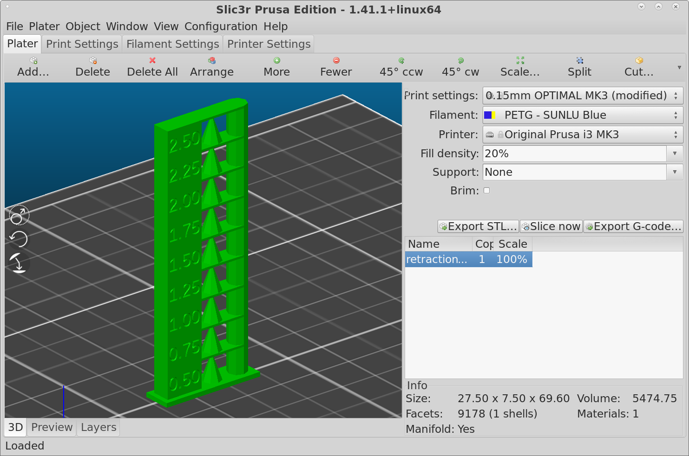

# Summary

A Python 3 program to generate custom retraction tower OpenSCAD, STL
and G-code files that can be used on a 3D printer to help in choosing
of a retraction setting that will reduce stringing.

WARNING: If you are not comfortable with running commands from the
command line, this tool may not be for you.

## Usage

NOTE: This has only been tested on a Prusa i3 MK3 printer using
slic3r-prusa3d (the Prusa version of Slic3r). It may not work
elsewhere.

* Run retraction-tower.py to generate retraction-tower.stl and
retraction-tower.gcode files (you can ignore the
retraction-tower.scad file).

```sh
python3 retraction-tower.py --levels 9 --start 0.5 --step-size 0.25
```

* Load the retraction-tower.stl file into slic3r-prusa3d.



* Enable the "Use firmware retraction" option found in the "General"
area under the "Printer Settings" in slic3r-prusa3d.


* Copy/Paste the contents of the retraction-tower.gcode file to the
bottom of the "Before layer change G-code" section found in the
"Custom G-code" area under "Printer Settings" in slic3r-prusa3d.


* Export the G-code and print.

## Example Invocations

To display usage:

```sh
python3 retraction-tower.py --help
```

To generate 9 levels with 0.5 mm on bottom, 0.75 mm, 1.00 mm, 1.25 mm,
1.50 mm, 1.75 mm, 2.00 mm, 2.25 mm and 2.50 mm on top.

```sh
python3 retraction-tower.py --levels 9 --start 0.5 --step-size 0.25
```

Similar, but omits the cone in the center:

```sh
python3 retraction-tower.py --levels 9 --start 0.5 --step-size 0.25 --cone-height 0
```

## Requirements

* Python 3 - https://www.python.org/
* OpenSCAD - http://www.openscad.org/

NOTE: You must be able to run *both* Python 3 and openscad from the
command line in order for this utility to work. To verify that your
system is capable, make sure you can run the following two commands
from the command line:

```sh
python3 --version
openscad --version
```

## Center Cone

User mkowalski suggested that the retraction test could be improved by
including a cone in the print. So, this program now generates a cone
centered between the label block and the cylindrical column by default
(you do have the option to turn this feature off). There are three
command line options that can be used to adjust the center cone.

*--cone-bot-radius MM*

Controls the size of the bottom radius. Specified in millimeters and
defaults to 2.5 millimeters if omitted.

*--cone-top-radius MM*

Controls the size of the top of the cone. Specified in millimeters and
defaults to 0.0 millimeters if omitted (to come to a point).

*--cone-height MM*

Controls the height of the cone. Specified in millimeters and
defaults to 7.2 millimeters if omitted (same as the level height).
Set this value to 0 to disable the inclusion of the cone.

NOTE: It is permissible to invert the cone by making the top radius
larger than the bottom radius.

## Files Produced

Three files will be produced when the command completes:

**retraction-tower.scad**

The OpenSCAD file used to generate the STL file. Typically, you can
just discard this file. However, it can be useful if you want to play
with the OpenSCAD instructions.

**retraction-tower.stl**

Printable model of the retraction tower. Stack of blocks with
retraction label on each block based on your parameters. This is the
model you will load into the slicer. This file takes time to generate,
so if you are just testing different options and viewing the results
in OpenSCAD, you can specify the *--stl 0* command line option disable
the creation of this file.

**retraction-tower.gcode**

G-code instructions to run whenever there is a z-layer change. These
instructions should adjust the firmware retraction setting based on
layer height. NOTE: Your need to make certain that firmware retraction
is enabled and that your printer supports the M207
firmware command to set the retraction.

Hint: You can use the "--base-name NAME" option if you want the base
part of the file name to be something other than "retraction-tower".

## References

* [M207 - Set Firmware
Retraction](http://marlinfw.org/docs/gcode/M207.html) - Some
documentation on the M207 G-code instruction found in the Marlin
firmware that can be used to adjust the firmware retraction length.

* [Slic3r and Marlin configuration for RepRap FW
retraction](https://www.prusaprinters.org/slic3r-and-marlin-configuration-for-reprap-firmware-retraction-2/) - Article
posted by Josef Průša related to adjusting the firmware retraction.
