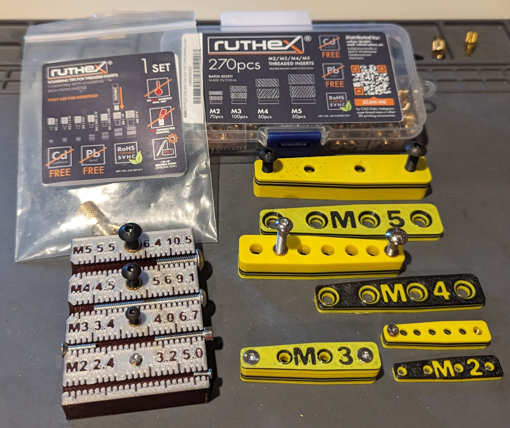
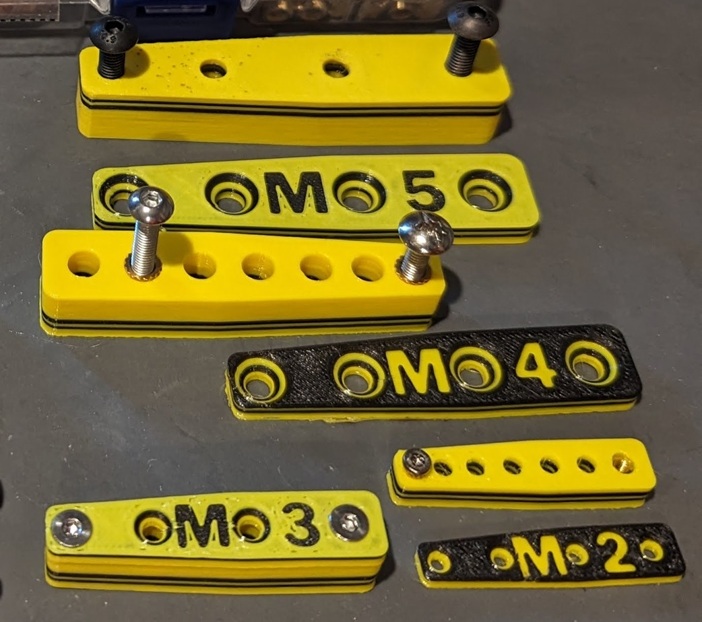
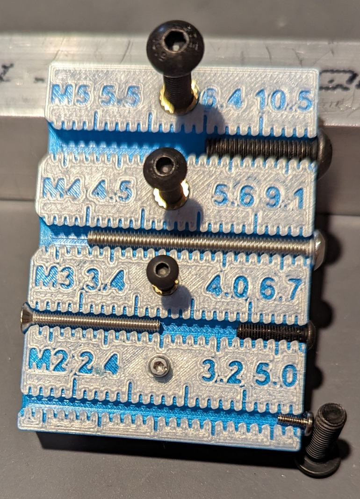
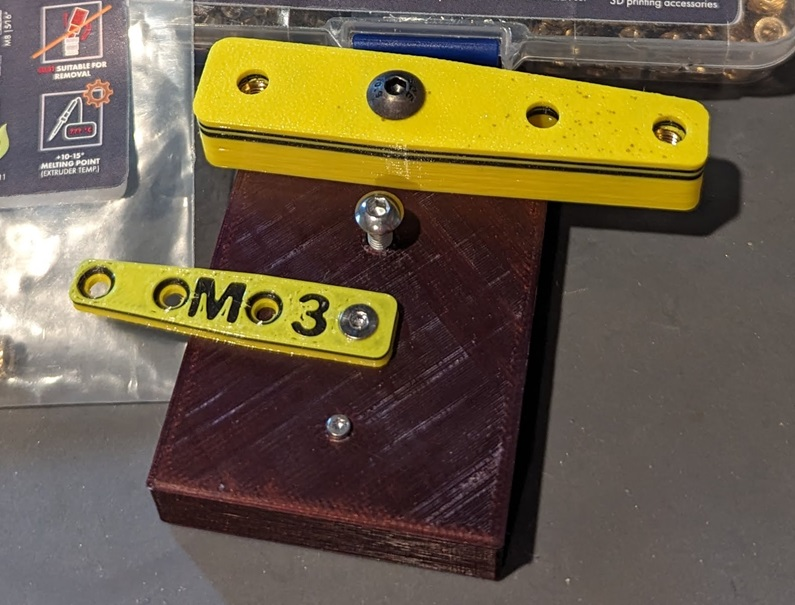

# Ruthex Heat-Set Insert Tools

# Background

I had some time to explore and decided to try making use of inserts in my designs and projects. After exploring YouTube and Amazon, I treated myself to some specialized soldering tips that were compatible with my Hakko-FX888D soldering station and some inserts from Ruthex to experiment with. This is what I ended up purchasing.

* [ruthex Threaded Inserts M2 + M3 + M4 + M5 Assortment Box](https://www.amazon.com/dp/B0CDBSGSXY?psc=1&ref=ppx_yo2ov_dt_b_product_details)
* [ruthex 7x Soldering Tips/Heat-Set Insert Tips](https://www.amazon.com/dp/B08K1BVGN9?psc=1&ref=ppx_yo2ov_dt_b_product_details)

Since, I'm uncertain as to standardization of heat set inserts, I've included the original CAD files (Fusion 360) in case you have inserts that require different dimensions or need to tweak clearance values.

## Goals

* To create simple test blocks that can be quickly 3D printed and then used to practice the skills involved in setting inserts.
* To create a simple measurement tool that holds each insert size that allows one to quickly verify that a bolt will thread into an insert properly, will fit the through the defined clearance hole size, can be used to measure both flat head and non-flat head bolts and serve as a quick reference when "drilling holes in CAD designs" for placing inserts.

I ended up with the following measurement tool, practice blocks and optional covers that can be bolted on.

## Practice Blocks

All of the practice blocks are included in a single [3MF File](ruthex_insert_practice.3mf).

* A single 3MF file is simpler to deal with than downloading a bunch of separate STL files.
* You can quickly delete the pieces you don't want, slice and print.
* The cover plates are optional, but allow you to check how things align.
* The blocks and cover plates are symmtrical along one axis. This means you can flip the cover plate over depending if you need to check a flat head screw (counter sunk) or a non-flat head screw.
* Each practice block has 4 blind holes and 4 through holes that allow you to experiment with placing up to 8 inserts per block.
* One end of the block tapers down from double the minimum wall thickness to the minimum wall thickness at the narrow end.
* The other end of the block has parallel wall side to allow clamping.

The following shows all of the practice blocks and covers included in the 3MF file.

There is no need to print the practice blocks in multiple colors unless you are taking photos.

NOTE: If you would like to customize the block, the [original Fusion 360 file](ruthex_insert_practice.f3d) is provided. To make changes, you should be able to:

* Modify the "insert_hole_diam", "insert_hole_depth" and "wall_thick" parameters (just type in the values appropriate for your inserts).
* For the clearance hole and counter sink, you need to open the "hole tool" in the time line and adjust the bolt parameters.
* For the labeling (if you care) you'll need to modify the last sketch in the timeline.

## Measurement and Test Tool

I decided to create a test, reference and measurement tool to go with my inserts.

* [ruthex_insert_measure_tool.3mf](ruthex_insert_measure_tool.3mf) - 3MF file to slice and print.
* [ruthex_insert_measure_tool.f3d](ruthex_insert_measure_tool.f3d) - The original Fusion 360 source file if you want to adjust.

The measurement tool includes the following features:

* Has a hole for the M2, M3, M4 and M5 inserts included in the Ruthex starter set.
* A through hole is included with the diameter set to a clearance hole appropriate for the bolt.
* An appropriate bolt should thread into the insert from either the top or bottom side. If it doesn't, then the bolt has an incompatible size or threading, the insert is tilted, or the clearance size needs to be adjusted for your printer.
* A ruler is included for both flat head and non-flat head bolts. There wasn't enough room for labeling the tick marks but the marks are 2 mm apart with the even values on the top side (long ticks at 10, 20, 30 and 40 mm) and the odd values on the bottom side (long ticks at 5, 15, 25, 35 and 45 mm).

Front side used for quick thread check, reference for sizes and measuring flat head screws (inserted from left) or non-flat head screws (inserted from right).

Back side can be used to check that clearance hole works and bolts are still able to thread into insert on opposite side. Note, this is the more secure way to use inserts when your design allows for this approach (takes more force to pull an insert out this direction).

## Reference Table

The following table lists the bolt clearance hole diameter, insert hole diameter (d3 from the Ruthex lid) and insert hole depth (l + 1 mm from the Ruthex lid) used in the 3D model. These labels also appear on the face of the 3D measurement tool.

| Bolt | Clearance Hole | Insert Hole | Insert Depth |
| :--- | -------------: | ----------: | -----------: |
| M2   |         2.4 mm |      3.2 mm |       5.0 mm |
| M3   |         3.4 mm |      4.0 mm |       6.7 mm |
| M4   |         4.5 mm |      5.6 mm |       9.1 mm |
| M5   |         5.5 mm |      6.4 mm |      10.5 mm |

See the [Tips & Tricks for Heat-Set Inserts Used in 3D Printing](https://www.cnckitchen.com/blog/tipps-amp-tricks-fr-gewindeeinstze-im-3d-druck-3awey) blog at the https://www.cnckitchen.com web site for a great write up on using heat-set inserts.

## Comments

* I've been 230 C for PETG and 215 C for PLA when placing inserts as this is the preheat temperature for these materials that my Prusa MK3S sets. However, the [CNC Kitchen guy](https://www.cnckitchen.com/blog/tipps-amp-tricks-fr-gewindeeinstze-im-3d-druck-3awey) recommends 10-20 C higher than the printing temperature, so I will likely start using 245 C for PETG and 225 for PLA.
* One of the YouTube videos I've watched suggested setting the insert in so that0.5 to 1.0 mm is left sticking out, then immediately flip the part over onto a flat piece of metal to press the insert in the rest of the way to help insure that the insert is not tilted. This has worked pretty well for me.
* I've had good luck at removing inserts by heating them up, then quickly finger tightning a bolt and pulling them out. They come out surprisingly clean (at least with PETG). That being said, I have also damaged the part - especially if the wall thickness is close to the minimum (like it is on the tapered end of the test blocks). I looked to see if there were any threaded soldering iron tips that could be used for removal, but failed to find any.
* Unfortunately, I came across the insert tool and inserts at [CNC Kitchen store](https://cnckitchen.store/) after having already making my Ruthex purchase. I've enjoyed several of his videos and would assume his tools would work. That being said, the Ruthex stuff has worked great.
* Not sure how useful M2 inserts are as they are extremely tiny (M2.5 would have been more useful).
* It is hard to get clean text at small sizes in 3D prints.
* To check how good you are at getting inserts aligned correctly and you have some long bolts, try feeding 4 bolts through multiple practice blocks and screwing into the inserts placed in the last block.